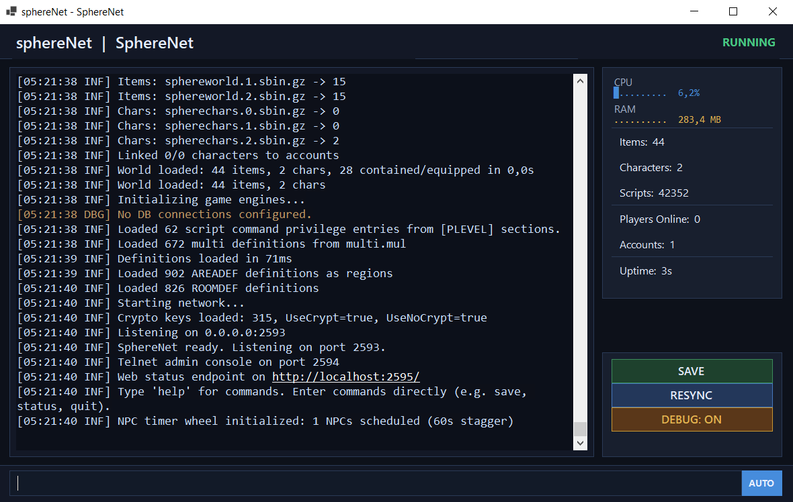

# SphereNet

> **[TR]** .NET 9 ile yazilmis, [Source-X](https://github.com/Sphereserver/Source-X) tabanli Ultima Online ozel sunucu emulatoru.
>
> **[EN]** A .NET 9 Ultima Online private server emulator based on [Source-X](https://github.com/Sphereserver/Source-X).



---

## Ozellikler / Features

- Source-X `.scp` script uyumlulugu / Source-X `.scp` script compatibility
- T2A → TOL eklenti paketi destegi / T2A → TOL expansion support
- Blowfish, Twofish, Huffman sifreleme / encryption
- Windows (GUI + headless), Linux, macOS
- Telnet yonetim konsolu + HTTP durum sayfasi / Telnet admin console + HTTP status page

---

## Source-X'te Olmayan Ozellikler / Beyond Source-X

### Coklu Kaydetme Formati / Multiple Save Formats

Source-X yalnizca duz metin `.scp` formatinda kaydeder. SphereNet 4 farkli formati destekler ve runtime'da format degistirilebilir.
Source-X only saves in plain text `.scp` format. SphereNet supports 4 formats with runtime switching.

| Format | Uzanti / Ext | Boyut / Size | Aciklama / Description |
|---|---|---|---|
| `Text` | `.scp` | 100% | Source-X uyumlu, insan okunabilir / Source-X compatible, human-readable |
| `TextGz` | `.scp.gz` | ~15% | Ayni metin, GZip sarili / Same text, GZip-wrapped |
| `Binary` | `.sbin` | ~50% | Tag-stream binary |
| `BinaryGz` | `.sbin.gz` | ~8-10% | En kucuk, en hizli / Smallest and fastest |

**Shard destegi / Shard support:** `SAVESHARDS=0` tek dosya, `1` size-based rolling, `2-16` paralel hash shard (UID % N, paralel I/O).
Runtime'da `.SAVEFORMAT BinaryGz 4` komutuyla format + shard degistirilir, migration tek adimda. /
Runtime `.SAVEFORMAT BinaryGz 4` command switches format + shards, one-shot migration.

### Coklu Veritabani / Multi-Database

Source-X tek bir MySQL baglantisi destekler. SphereNet ayni anda birden fazla veritabanina baglanir — her birinin kendi ayarlari, thread modu ve timeout'u vardir.
Source-X supports a single MySQL connection. SphereNet connects to multiple databases simultaneously — each with its own settings, thread mode and timeouts.

```ini
[MYSQL default]
Host=localhost
User=root
Password=secret
Database=sphere
AutoConnect=1

[MYSQL logging]
Host=10.0.0.2
User=logger
Password=logpass
Database=logs
UseThread=1
```

Script'te `db.select <isim>` ile aktif baglanti degistirilir / Switch active connection with `db.select <name>` in scripts:
```
db.select logging
db.execute "INSERT INTO logs (msg) VALUES ('event')"
db.select default
db.query "SELECT * FROM users WHERE id=1"
```

### Multicore Tick Pipeline

Source-X tek thread'de calisir. SphereNet tick islemeyi dort faza ayirir, paralel calistirir — hata durumunda otomatik tek thread'e duser.
Source-X runs single-threaded. SphereNet splits tick processing into four parallel phases — auto-fallback to single-thread on failure.

| Faz / Phase | Tur / Type | Aciklama / Description |
|---|---|---|
| Snapshot | Paralel | Sektor tick, NPC snapshot |
| Build | Paralel | NPC karar hesabi (salt okunur) / NPC decisions (read-only) |
| Apply | Seri | Kararlar UID sirasinda uygulanir / Decisions applied in UID order |
| Flush | Seri | Decay, isik, telnet, web / Decay, light, telnet, web |

### MemoryMapped Harita / MemoryMapped Maps

Source-X harita dosyalarini tamamen RAM'e yukler. SphereNet `MemoryMappedFile` ile yukler — isletim sistemi hangi sayfalarin RAM'de kalacagini yonetir, ~200MB tasarruf.
Source-X loads map files entirely into RAM. SphereNet uses `MemoryMappedFile` — the OS manages page residency, saving ~200MB.

### WinForms Yonetim Konsolu / WinForms Admin Console

Source-X'te yalnizca terminal ciktisi vardir. SphereNet Windows'ta renk kodlu log, CPU/RAM metrikleri, canli istatistikler ve komut gecmisi sunan bir GUI konsol icerir.
Source-X only has terminal output. SphereNet includes a Windows GUI console with color-coded logs, CPU/RAM metrics, live stats and command history.

### NPC Timer Wheel

Source-X her NPC'yi her tick'te tarar. SphereNet 256 slotlu zamanlama carki kullanir — NPC'ler `nextActionTime`'a gore slot'lara atanir, O(1) zamanlama.
Source-X scans every NPC every tick. SphereNet uses a 256-slot hashed timer wheel — NPCs assigned by `nextActionTime`, O(1) scheduling.

---

## Oyun Sistemleri / Game Systems

| Sistem / System | Aciklama / Description |
|---|---|
| **Savas / Combat** | Swing timer, elemental damage, armor resist |
| **Buyu / Magic** | 60+ buyu, interruption, reagent / 60+ spells |
| **Yetenekler / Skills** | 31+ handler, trigger entegrasyonu / integration |
| **Zanaat / Crafting** | Script-based recipe, gump UI |
| **NPC AI** | Monster/Pet/Healer/Guard/Vendor/Animal, A* pathfinding |
| **Konut / Housing** | Multi.mul, decay, co-owner/friend, lockdown |
| **Ticaret / Trade** | Vendor buy/sell, restock, SecureTrade |
| **Lonca & Parti / Guild & Party** | Party chat, guild war/alliance |
| **Ceza / Justice** | Criminal flag, murder count, karma/fame, jail |
| **Hava / Weather** | Yagmur/kar, gun/gece, mevsim / Rain/snow, day/night, seasons |
| **Trigger** | @Login, @Death, @Hit, @Click, @DClick, @Equip ve dahasi / and more |

---

## Hizli Baslangic / Quick Start

```bash
git clone https://github.com/Yunusolcay/sphereNet.git
cd sphereNet
dotnet build
```

`config/sphere.ini` duzenleyin, UO istemci dosyalarini `MULFILES` yoluna koyun, scriptleri `scripts/` altina ekleyin.
Edit `config/sphere.ini`, place UO client files at `MULFILES` path, add scripts under `scripts/`.

```bash
dotnet run --project src/SphereNet.Server              # Windows GUI
dotnet run --project src/SphereNet.Server -- --headless # headless
```

| Port | Amac / Purpose |
|---|---|
| 2593 | UO istemci / client |
| 2594 | Telnet admin |
| 2595 | HTTP durum / status |

---

## Proje Yapisi / Project Structure

```
src/
├── SphereNet.Core/          # Temel tipler, enum / Core types, enums
├── SphereNet.Network/       # UO protokol, TCP, sifreleme / protocol, encryption
├── SphereNet.Scripting/     # Script parser & execution
├── SphereNet.Game/          # Oyun mantigi / Game logic (AI, Combat, Magic, Death, ...)
├── SphereNet.MapData/       # MUL/UOP harita okuyucu / map readers
├── SphereNet.Persistence/   # Save/load
└── SphereNet.Server/        # Giris noktasi / Entry point
```

---

## On Kosullar / Prerequisites

- [.NET 9.0 SDK](https://dotnet.microsoft.com/download/dotnet/9.0)
- Ultima Online istemci dosyalari / UO client data files

## Test

```bash
dotnet test
```

---

## Lisans / License

Acik kaynak / Open source — [LICENSE](LICENSE)

## Tesekkurler / Acknowledgments

- [SphereServer Source-X](https://github.com/Sphereserver/Source-X)
- [ServUO](https://github.com/ServUO/ServUO)
- [Ultima Online](https://uo.com/) — Origin Systems / Electronic Arts
